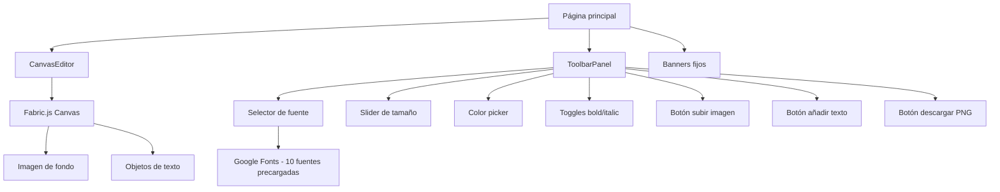

# Arquitectura — Fabric.js (Editor de memes para builders)

## Stack elegido

**Next.js 14 (App Router) + Tailwind + shadcn/ui**

Justificación: aunque Fabric.js es 100% client-side y no necesita API routes para proteger keys, Next.js aporta dos cosas necesarias aquí:
1. Carga optimizada de Google Fonts vía `next/font/google` (preload, swap, sin FOUT)
2. Consistencia con el resto de demos del ecosistema concriterio.tools
3. Metadata y SEO para la página de la demo

Si fuera solo la demo sin contexto de marca, Astro sería suficiente. Pero la uniformidad del ecosistema y la gestión de fuentes justifican Next.js.

## Diagrama de componentes



## Estructura de carpetas

```
fabricjs-concriterio-tools/
├── app/
│   ├── layout.tsx
│   ├── page.tsx
│   └── globals.css
├── components/
│   ├── canvas-editor.tsx      # Componente principal del canvas Fabric.js
│   ├── toolbar-panel.tsx      # Panel de herramientas de texto
│   ├── font-selector.tsx      # Dropdown con preview de fuentes
│   ├── download-button.tsx    # Exportación a PNG
│   ├── upload-button.tsx      # Carga de imagen base
│   └── banners.tsx            # Banners fijos de consultoría, newsletter, repo
├── lib/
│   ├── fonts.ts               # Configuración de Google Fonts
│   └── canvas-utils.ts        # Helpers de Fabric.js (inicialización, exportación)
├── public/
│   └── builders-anonimos.png  # Imagen preinstalada
├── docs/
├── .env.example
├── README.md
└── CLAUDE.md
```

## Integraciones externas

- **Fabric.js v6** — Librería principal. Se instala vía npm (`fabric`). Toda la interacción es client-side.
- **Google Fonts** — Se cargan 10 tipografías predefinidas vía `next/font/google`. No se usa la API de Google Fonts para listar fuentes dinámicamente (innecesario para 10 fuentes). Las fuentes se precargan en el layout.

## Estrategia de protección de API keys

No aplica. Fabric.js es una librería client-side sin API keys. La API key de Google Fonts es opcional y pública por naturaleza (se usa desde cliente). Si se decide no usar key, las fuentes se cargan igualmente vía `next/font/google` que no requiere key.

## Configuración de Vercel

- Framework preset: Next.js
- Build command: `next build`
- Output directory: `.next`
- Variables de entorno: solo `NEXT_PUBLIC_GOOGLE_FONTS_API_KEY` (opcional)
- Dominio: fabricjs.concriterio.tools (wildcard ya configurado)
